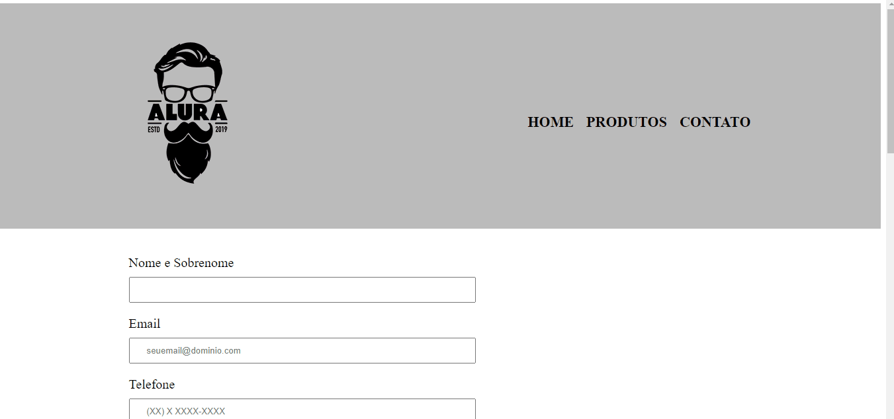

# Barbearia_Alura_Parte_3
Aplicação de **Programação** desenvolvida durante o [Curso de
HTML5 e CSS3 parte 3: trabalhando com formulários e tabelas](https://cursos.alura.com.br/course/html5-css3-formularios-tabelas), na plataforma **[Alura](https://cursos.alura.com.br/)**, pelo instrutor [Pedro Marins](https://pedromarins.com/links/).

## 📒 Conhecimentos adquiridos

Durante seu desenvolvimento foram exercitados diversos conhecimentos, deixo listado abaixo alguns deles:

* Aprofundamento em conhecimentos da linguagem de estilização em sua ultima versão o CSS3;
* Aprofundamento em conhecimentos da linguagem de estruturação em sua ultima versão o HTML5;
* Aprofundamento na estruturação do CSS;
* Aprendizado da hierarquia dentro do CSS;
* Compreensão maior da conexão entre HTML e CSS;
* Aprendizado de como formulários são introduzidos dentro de HTML;
* Aprendizado de como os tipos de `input` que você usa mudam a experiência do usuário de seu site;
* Aprendizado de tag´s de estruturação e organização para facilitar a leitura no HTML;
* Aprendizado de como repetir o mesmo CSS várias vezes sem usar uma classe;
* Aprendizado de novos parâmetros para a estilização do HTML por meio de CSS;
* Aprendizado de como colocar tabelas no HTML;
* Aprendizado de como funciona uma tabel em um site e como ela é feita;
* Reforço de como a adição de [alt´s](https://pt.semrush.com/blog/alt-text-para-imagens/);
* Melhora nas minhas habilidades de usar o [clean code](https://www.alura.com.br/artigos/o-que-e-clean-code).

## ✨ Funcionalidades do projeto

A aplicação apresenta um site de uma **barbearia**, uma _tela de um navegador_ apresentando **um site de uma barbearia mostrando uma página de produtos, com um cabeçalho contendo a logo, e seção de navegação entre as páginas, um produtos em si, um rodapé contendo logo e copyright**.

  

  

## :hammer: Tecnologias usadas
Neste projeto foram usadas as seguintes tecnologias:
> Framework [HTML e CSS](https://www.homehost.com.br/blog/tutoriais/tags-html/)

> Linguagem/Editor [Sublime Text](https://www.sublimetext.com/)
  
  ## Projeto:
**[CLIQUE AQUI PARA UTILIZAR O PROJETO](https://renanwuicik7.github.io/Barbearia_Alura_Parte_3/)** 😉
